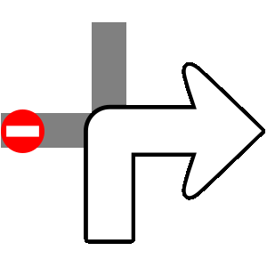
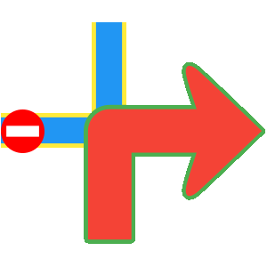

# Routes
A route represents a navigable path between two or more landmarks (waypoints), including distance, estimated time, and navigation instructions.

Compute routes in different ways:

- **Waypoint-based** - Based on 2 or more landmarks (navigable)
- **Over-track** - Based on a predefined path from GPX files or other sources (navigable)
- **Route ranges** - Not navigable, without segments or instructions

Navigable routes consist of segments. Each segment represents the portion between consecutive waypoints with its own route instructions.

## Create Routes
Routes cannot be instantiated directly. Compute them based on a list of landmarks. See [Get started with Routing](../07-Routing/02-Get%20Started%20wtih%20Routing.md#get-started-with-routing) for details.

>  🚨 **Alert**: Calculating a route does not automatically display it on the map. See [Display routes](../04-Maps/05-Display%20Map/04-Display%20Routes.md#display-routes) for instructions.

## Route Types
The SDK supports multiple route types, each tailored for specific use cases:

- **Normal routes** - Standard routes for typical navigation
- P**ublic transport (PT) routes** - Routes using public transport with frequency, ticket info, and transit-specific data
- **Over-track (OT) routes** - Routes based on predefined paths from GPX files or drawn routes
- **Electric vehicle (EV) routes** - Routes for EVs with charging station information (not fully implemented)

### Route Classes
Each route type has specific classes:

| Route Type | Route Class | Segment Class | Instruction Class |
|------------|-------------|---------------|-------------------|
| Normal Route | `Route` | `RouteSegment` | `RouteInstruction` |
| Public Transport Route | `PTRoute` | `PTRouteSegment` | `PTRouteInstruction` |
| Over-Track Route | `OTRoute` | Not Available | Not Available |
| Electric Vehicle Route | `EVRoute` | `EVRouteSegment` | `EVRouteInstruction` |

These classes extend base classes (`RouteBase`, `RouteSegmentBase`, `RouteInstructionBase`) that provide common features.

## Route Structure
Key route characteristics:

| Field | Type | Explanation |
|------|------|-------------|
| `geographicArea` | `GeographicArea` | Geographic boundary or region covered by the route. |
| `polygonGeographicArea` | `PolygonGeographicArea` | Polygon representing the geographic area as a series of connected points. |
| `tilesGeographicArea` | `TilesCollectionGeographicArea` | Collection of map tiles representing the geographic area. |
| `dominantRoads` | `List<String>` | List of road names or identifiers that dominate the route. |
| `hasFerryConnections` | `bool` | Indicates whether the route includes ferry connections. |
| `hasTollRoads` | `bool` | Indicates whether the route includes toll roads. |
| `tollSections` | `List<TollSection>` | List of toll sections along the route. |
| `incursCosts` | `bool` | Specifies whether the route incurs monetary costs such as tolls or fees (**deprecated**; same as `hasTollRoads`). |
| `routeStatus` | `RouteStatus` | Indicates the current route state. When navigating, deviations may trigger route recalculation; the status can reflect successful computation, lack of internet connection, or recomputation errors. |
| `terrainProfile` | `List<double>` | Terrain elevation profile along the route, represented as a list of elevation values. |
| `segments` | `List<RouteSegment>` | Collection of route segments representing portions of the route. Segments are split based on the initial waypoints used to compute the route. For public transport routes, a segment represents either a pedestrian or a transit portion. |
| `trafficEvents` | `List<RouteTrafficEvent>` | List of traffic events affecting the route, such as delays or road closures. |

## RouteSegment Structure

A route segment represents the portion between two consecutive waypoints. For public transport routes, segments are categorized as pedestrian or public transit sections.

| Field / Method | Return Type | Description |
|---------------|-------------|-------------|
| `waypoints` | `List<Landmark>` | Returns the list of landmarks representing the start and end waypoints of the route segment. |
| `timeDistance` | `TimeDistance` | Provides the segment length in meters and the estimated travel time in seconds. |
| `geographicArea` | `RectangleGeographicArea` | Returns the smallest rectangle enclosing the geographic area of the route segment. |
| `incursCosts` | `bool` | Indicates whether traveling this route segment incurs a cost to the user. |
| `summary` | `String` | Provides a summary of the route segment. |
| `instructions` | `List<RouteInstruction>` | Returns the list of route instructions for the segment. |
| `isCommon` | `bool` | Indicates whether the segment shares the same travel mode as the parent route. Mainly used for public transport routes. |
| `tollSections` | `List<TollSection>` | List of toll sections along the route segment. |


## RouteInstruction Structure
Route instructions provide detailed navigation guidance, including coordinates, turn directions, distances, and time to waypoints.

| Method | Return Type | Description |
|--------|-------------|-------------|
| `coordinates` | `Coordinates` | Gets the coordinates for this route instruction. |
| `countryCodeISO` | `String` | Gets the ISO 3166-1 alpha-3 country code for the navigation instruction. |
| `exitDetails` | `String` | Gets the exit route instruction text. |
| `followRoadInstruction` | `String` | Gets the textual description for follow-road information. |
| `realisticNextTurnImg` | `AbstractGeometryImg` | Gets the image for realistic turn information. |
| `remainingTravelTimeDistance` | `TimeDistance` | Gets the remaining travel time and distance until the destination. |
| `remainingTravelTimeDistanceToNextWaypoint` | `TimeDistance` | Gets the remaining travel time and distance to the next waypoint. |
| `roadInfo` | `List<RoadInfo>` | Gets road information. |
| `roadInfoImg` | `RoadInfoImg` | Gets the road information image. |
| `signpostDetails` | `SignpostDetails` | Gets extended signpost details. |
| `signpostInstruction` | `String` | Gets the textual description for signpost information. |
| `timeDistanceToNextTurn` | `TimeDistance` | Gets the distance and time to the next turn. |
| `traveledTimeDistance` | `TimeDistance` | Gets the traveled time and distance. |
| `turnDetails` | `TurnDetails` | Gets full details for the turn. |
| `turnImg` | `Img` | Gets the image for the turn. |
| `turnInstruction` | `String` | Gets the textual description for the turn. |
| `hasFollowRoadInfo` | `bool` | Checks whether follow-road information is available. |
| `hasSignpostInfo` | `bool` | Checks whether signpost information is available. |
| `hasTurnInfo` | `bool` | Checks whether turn information is available. |
| `hasRoadInfo` | `bool` | Checks whether road information is available. |
| `isCommon` | `bool` | Indicates whether this instruction shares the same transport mode as the parent route. |
| `isExit` | `bool` | Checks whether this instruction represents a main road exit. |
| `isFerry` | `bool` | Checks whether this instruction is on a ferry segment. |
| `isTollRoad` | `bool` | Checks whether this instruction is on a toll road. |

> 📝 **Note:** Distinguish between `NavigationInstruction` and `RouteInstruction`:

- `NavigationInstruction` - Real-time, turn-by-turn navigation based on current position (only during navigation or simulation)
- `RouteInstruction` - Route overview available immediately after calculation (instructions don't change during navigation)

## Related Classes
### TimeDistance
The `TimeDistance` class provides time and distance details to important points of interest.

It differentiates between road types:

- **Restricted** - Non-public roads
- **Unrestricted** - Publicly accessible roads

| Field | Type | Explanation |
|------|------|-------------|
| `unrestrictedTimeS` | `int` | Unrestricted time in seconds. |
| `restrictedTimeS` | `int` | Restricted time in seconds. |
| `unrestrictedDistanceM` | `int` | Unrestricted distance in meters. |
| `restrictedDistanceM` | `int` | Restricted distance in meters. |
| `ndBeginEndRatio` | `double` | Ratio representing how restricted time and distance are divided between the beginning and the end. |
| `totalTimeS` | `int` | Total time in seconds (sum of unrestricted and restricted times). |
| `totalDistanceM` | `int` | Total distance in meters (sum of unrestricted and restricted distances). |
| `isEmpty` | `bool` | Indicates whether the total time is zero. |
| `isNotEmpty` | `bool` | Indicates whether the total time is non-zero. |
| `hasRestrictedBeginEndDifferentiation` | `bool` | Indicates whether restricted values are differentiated between the beginning and the end based on the ratio. |
| `restrictedTimeAtBegin` | `int` | Restricted time allocated to the beginning, based on the ratio. |
| `restrictedTimeAtEnd` | `int` | Restricted time allocated to the end, based on the ratio. |
| `restrictedDistanceAtBegin` | `int` | Restricted distance allocated to the beginning, based on the ratio. |
| `restrictedDistanceAtEnd` | `int` | Restricted distance allocated to the end, based on the ratio. |


## Signpost Details
Signposts near roadways indicate intersections and directions. The SDK provides realistic image renderings with additional information.

The `SignpostDetails` class provides:
| Member | Type | Description |
|--------|------|-------------|
| `backgroundColor` | `Color` | Returns the background color of the signpost. |
| `borderColor` | `Color` | Returns the border color of the signpost. |
| `textColor` | `Color` | Returns the text color of the signpost. |
| `hasBackgroundColor` | `bool` | Indicates whether the signpost has a background color. |
| `hasBorderColor` | `bool` | Indicates whether the signpost has a border color. |
| `hasTextColor` | `bool` | Indicates whether the signpost has a text color. |
| `items` | `List<SignpostItem>` | Returns the list of `SignpostItem` elements associated with the signpost. |

Each `SignpostItem` provides:

| Member | Type | Description |
|--------|------|-------------|
| `row` | `int` | Returns the one-based row of the item. A value of `0` indicates not applicable. |
| `column` | `int` | Returns the one-based column of the item. A value of `0` indicates not applicable. |
| `connectionInfo` | `SignpostConnectionInfo` | Returns the connection type of the item (`branch`, `towards`, `exit`, `invalid`). |
| `phoneme` | `String` | Returns the phoneme assigned to the item, if available; otherwise an empty string. |
| `pictogramType` | `SignpostPictogramType` | Returns the pictogram type for the item (e.g. `airport`, `busStation`, `parkingFacility`). |
| `shieldType` | `RoadShieldType` | Returns the shield type for the item (e.g. `county`, `state`, `federal`, `interstate`). |
| `text` | `String` | Returns the text assigned to the item, if available. |
| `type` | `SignpostItemType` | Returns the type of the item (e.g. `placeName`, `routeNumber`, `routeName`). |
| `hasAmbiguity` | `bool` | Indicates whether the item has ambiguity. Avoid using such items for TTS. |
| `hasSameShieldLevel` | `bool` | Indicates whether the road code item has the same shield level as its associated road. |


### Turn Details

The `TurnDetails` class provides:

- **event** - Turn type enum (straight, right, left, lightLeft, lightRight, sharpRight, sharpLeft, roundaboutExitRight, and more)
- **abstractGeometryImg** - Abstract turn image (verify validity). Customize colors with `AbstractGeometryImageRenderSettings`
- **roundaboutExitNumber** - Roundabout exit number (if available)

**Abstract Image vs. Turn Image**
Compare images from `abstractGeometryImg` (left) and `turnImg` (right):




- **abstractGeometryImg** - Detailed intersection representation with customizable colors for theme alignment
- **turnImg** - Simplified turn schematic focusing on essential direction (no customization

> 💡 **Tip:** 
> Use the `uid` getter to retrieve each image's unique identifier. Update the UI only when the ID changes to enhance navigation performance.

**Customize Abstract Geometry Images**
Use `AbstractGeometryImageRenderSettings` to customize render settings and colors:
```
 AbstractGeometryImageRenderSettings customizedRenderSettings = const AbstractGeometryImageRenderSettings(
    activeInnerColor: Colors.red,
    activeOuterColor: Colors.green,
    inactiveInnerColor: Colors.blue,
    inactiveOuterColor: Colors.yellow,
);
```
These settings produce:



## Toll Sections
The `TollSection` class represents a tolled route portion, defining start and end points (in meters from route start), cost, and currency.
| Member | Type | Description |
|--------|------|-------------|
| `startDistanceM` | `int` | Distance in meters where the section starts, measured from the route starting point. |
| `endDistanceM` | `int` | Distance in meters where the section ends, measured from the route starting point. |
| `cost` | `double` | Cost associated with the section in the specified currency. |
| `currency` | `String` | Currency code (e.g. `EUR`, `USD`). |

When cost data is unavailable, `cost` is 0 and `currency` is an empty string.

> 💡 **Tip:** Get WGS coordinates of toll section start and end using `Route.getCoordinateOnRoute` with `startDistanceM` and `endDistanceM` values.

## Change Instruction Language
Route instruction texts follow the SDK language settings. See [Internationalization](/02-Get%20Started/04-Internationalization.md) for details.


