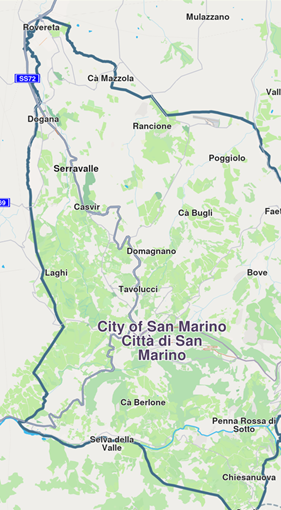

# Get Started with Maps
Learn how to display a map view and use the `GemMapController` to enable additional map functionalities.

## Display a Map
The `GemMap` widget, a subclass of `StatefulWidget`, provides powerful mapping capabilities with a wide range of configurable options. The following code demonstrates how to display a map view in your main.dart file:

```
import 'package:flutter/material.dart';

import 'package:unl_navigation_flutter/core.dart';
import 'package:unl_navigation_flutter/map.dart';

const projectApiToken = String.fromEnvironment('GEM_TOKEN');

void main() {
  runApp(const MyApp());
}

class MyApp extends StatelessWidget {
  const MyApp({super.key});

  @override
  Widget build(BuildContext context) {
    return const MaterialApp(
      debugShowCheckedModeBanner: false,
      title: 'Hello Map',
      home: MyHomePage(),
    );
  }
}

class MyHomePage extends StatefulWidget {
  const MyHomePage({super.key});

  @override
  State<MyHomePage> createState() => _MyHomePageState();
}

class _MyHomePageState extends State<MyHomePage> {
  @override
  void dispose() {
    GemKit.release();
    super.dispose();
  }

  @override
  Widget build(BuildContext context) {
    return Scaffold(
      appBar: AppBar(
        backgroundColor: Colors.deepPurple[900],
        title: const Text('Hello Map', style: TextStyle(color: Colors.white)),
      ),
      body: const GemMap(
        appAuthorization: projectApiToken,
        onMapCreated: _onMapCreated,
      ),
    );
  }

  void _onMapCreated(GemMapController mapController) {
    // Code executed when the map is initialized
  }
}
```


## Use the map controller
The `GemMap` widget includes an `onMapCreated` callback, which is triggered once the map has finished initializing. This callback provides a `GemMapController` to enable additional map functionalities.

```
const GemMap(
  appAuthorization: projectApiToken,
  onMapCreated: _onMapCreated,
),
```
> 💡 **Tip:** Multiple `GemMap` widgets can be instantiated within a single application, allowing you to display different data on each map. Each `GemMap` is independently controlled via its respective `GemMapController`.

Certain settings, such as language, overlay visibility, and position tracking, are shared across all `GemMap` instances within the application.