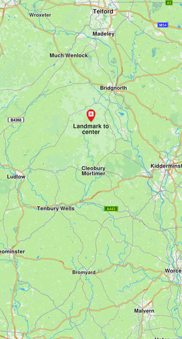
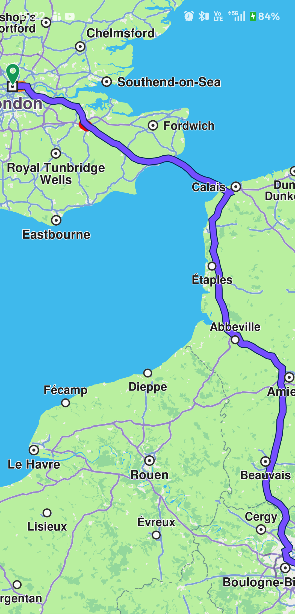
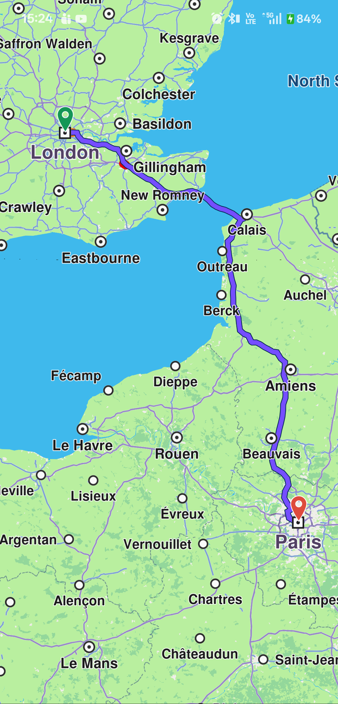
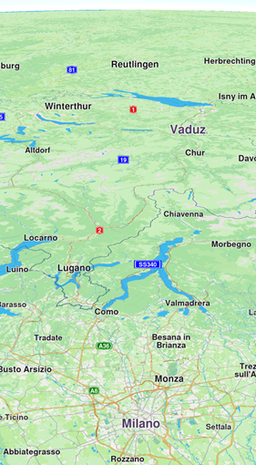
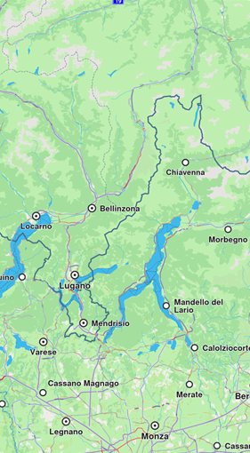
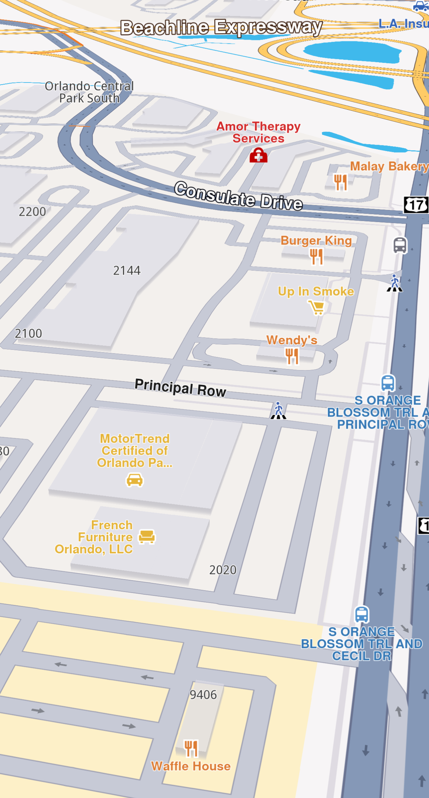
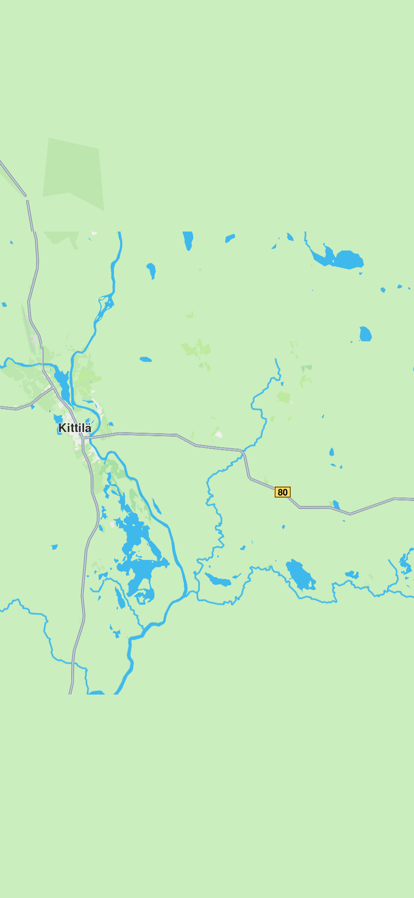

# Adjust the Map View

The Navigation SDK provides multiple ways to modify the map view, center on coordinates or areas, and explore different perspectives. Control map features like zoom, tilt, rotation, and centering through the `GemMapController` provided by `GemMap`.

## Get the Map Viewport
The map viewport is the visible area displayed by the `GemMap` widget. The `viewport` getter returns a `Rectangle` object containing xy coordinates (left and top) and dimensions (width and height).

The top-left coordinate is [0, 0] and bottom-right is [`viewport.width`, `viewport.height`].

```
final currentViewport = mapController.viewport
```
> 📝 **Note:** The width and height are measured in physical pixels. To convert them to Flutter logical pixels, use the `GemMapController.devicePixelSize `getter. See [Flutter documentation](/link:https://api.flutter.dev/flutter/dart-ui/FlutterView/devicePixelRatio.html) for more details.

Convert physical pixels to logical pixels:

```
final currentViewport = mapController.viewport;
final flutterHeightPixels = currentViewport.height / mapController.devicePixelSize;
final flutterWidthPixels = currentViewport.width / mapController.devicePixelSize;
```
## Center the Map
Center the map using methods like `centerOnCoordinates`, `centerOnArea`, `centerOnAreaRect`, `centerOnRoute`, `centerOnRoutePart`, `centerOnRouteInstruction`, and `centerOnRouteTrafficEvent`.

### Center on coordinates
Center [WGS](/link:https://en.wikipedia.org/wiki/World_Geodetic_System) coordinates on the viewport using the `centerOnCoordinates` method:

```
mapController.centerOnCoordinates(Coordinates(latitude: 45, longitude: 25));
```
Add a linear animation while centering:

```
controller.centerOnCoordinates(
    Coordinates(latitude: 52.14569, longitude: 1.0615),
    animation: GemAnimation(type: AnimationType.linear, duration: 2000));
```
> 💡 **Tip:** Call `skipAnimation()` to bypass the animation. Use `isAnimationInProgress` to check if an animation is running, or `isCameraMoving` to check if the camera is moving.

>  🚨 **Alert**: Do not confuse `zoomLevel` with `slippyZoomLevel`. The `slippyZoomLevel` is linked to the tile system.

### Convert between screen and WGS coordinates
Convert a screen position to WGS coordinates using `transformScreenToWgs()`:
```
Coordinates coordsToCenter = mapController.transformScreenToWgs(Point(pos.x, pos.y));

mapController.centerOnCoordinates(coordsToCenter, zoomLevel: 70);
```
> 📝 **Note:** If the applied style includes elevation and terrain data is loaded, `transformScreenToWgs` returns `Coordinates` objects with altitude. Check for terrain support using the `hasTerrainTopography` getter.

Convert WGS coordinates to screen coordinates using `transformWgsToScreen()`:
```
Coordinates wgsCoordinates = Coordinates(latitude: 8, longitude: 25);

Point<int> screenPosition = mapController.transformWgsToScreen(wgsCoordinates);
```
> 💡 **Tip:** Use `transformWgsListToScreen` to convert multiple WGS coordinates to screen coordinates. Use `transformScreenToWgsRect` to convert a `Rectangle<int>` to a `RectangleGeographicArea`.

### Center on coordinates at a screen position
Center on a different viewport area by providing a `screenPosition` parameter as a `Point<int>`. The `x` coordinate should be in [0, `viewport.width`] and `y` in [0, `viewport.height`].

>  🚨 **Alert**: The `screenPosition` parameter uses physical pixels, not logical pixels.

Center the map at one-third of its height:

```
final physicalHeightPixels = mapController.viewport.height;
final physicalWidthPixels = mapController.viewport.width;

mapController.centerOnCoordinates(
    Coordinates(latitude: 52.48209, longitude: -2.48888),
    zoomLevel: 40,
    screenPosition: Point(physicalWidthPixels ~/ 2, physicalHeightPixels ~/ 3),
);
```



> 💡 **Tip:** Pass additional parameters like `animation`, `mapAngle`, `viewAngle`, and `zoomLevel` for more control.

### Center on an area
Center on a specific `GeographicArea` such as a `RectangleGeographicArea` defined by top-left and bottom-right coordinates:
```
final topLeftCoords = Coordinates(latitude: 44.93343, longitude: 25.09946);
final bottomRightCoords = Coordinates(latitude: 44.93324, longitude: 25.09987);
final area = RectangleGeographicArea(topLeft: topLeftCoords, bottomRight: bottomRightCoords);

mapController.centerOnArea(area);
```
This centers the view on the geographic area, ensuring the `GeographicArea` covers most of the viewport. To center the area at a specific viewport coordinate, provide a `screenPosition` parameter as a `Point<int>`.

Alternatively, use `centerOnAreaRect` to center on a specific viewport region. Pass a `viewRc` parameter as a `Rectangle<int>` to define the target screen region. The `Rectangle` determines the positioning relative to the top-left coordinates, with the top-right corner at `left` + `Rectangle`'s width.

> 📝 **Note:** As the `Rectangle` width and height decrease, the view becomes more zoomed out. For a zoomed-in view, use larger values within [1, viewport.width - x] and [1, viewport.height - y].

> 💡 **Tip:** Use `getOptimalRoutesCenterViewport` and `getOptimalHighlightCenterViewport` to compute the optimal viewport region for routes and highlights.

### Center on an area with padding
Center on an area with padding by adjusting screen coordinates (in physical pixels) with the padding value. Create a new `RectangleGeographicArea` using the padded screen coordinates transformed to WGS coordinates via `transformScreenToWgs(point)`.

```
// Getting the RectangleGeographicArea in which the route belongs
final routeArea = route.geographicArea;
const paddingPixels = 200;

// Getting the top left point screen coordinates in physical pixels
final routeAreaTopLeftPoint = mapController.transformWgsToScreen(routeArea.topLeft);

// Adding padding by shifting point in the top left
final topLeftPadded = Point<int>(
    routeAreaTopLeftPoint.x - paddingPixels,
    routeAreaTopLeftPoint.y - paddingPixels,
);

final routeAreaBottomRightPoint = mapController.transformWgsToScreen(routeArea.bottomRight);

// Adding padding by shifting point downwards three times the padding
final bottomRightPadded = Point<int>(
    routeAreaBottomRightPoint.x + paddingPixels,
    routeAreaBottomRightPoint.y + 3 * paddingPixels,
);

// Converting points with padding to wgs coordinates
final paddedTopLeftCoordinate = mapController.transformScreenToWgs(topLeftPadded);
final paddedBottomRightCoordinate = mapController.transformScreenToWgs(bottomRightPadded);

mapController.centerOnArea(RectangleGeographicArea(
    topLeft: paddedTopLeftCoordinate,
    bottomRight: paddedBottomRightCoordinate,
));
```

Route without padding


Route with center padding

>  🚨 **Alert**: When applying padding using Flutter panel heights, note that heights are measured in logical pixels, not physical pixels. A conversion is required, as detailed in [Get the map viewport](#get-the-map-viewport).

## Adjust the zoom level
Get the current zoom level using the `zoomLevel` getter. Higher values bring the camera closer to the terrain. Change the zoom level using `setZoomLevel`:

```
final int zoomLevel = mapController.zoomLevel;
mapController.setZoomLevel(50);
```
The value must be between 0 and 360. By default, the camera has a rotation angle of 0 degrees (north-up alignment). The rotation axis is always perpendicular to the ground and passes through the camera.

You can also use the `mapAngle` setter from the `GemMapController` class.

## Adjust the view angle
The camera can transform the flat 2D map into a 3D perspective, allowing you to view features like distant roads appearing on the horizon. By default, the camera has a top-down perspective (viewAngle = 90°).

In addition to adjusting the camera's view angle, you can modify its tilt angle. The `tiltAngle` is defined as the complement of the `viewAngle`, calculated as `tiltAngle = 90-viewAngle`

In order to change the view angle of camera you need to access the `preferences` field of `GemMapController` like so:

```
final double viewAngle = mapController.preferences.viewAngle;
mapController.preferences.setViewAngle(45);
```

Map with a view angle of 60 degrees


Map with a view angle of 0 degrees

To adjust the camera's perspective dynamically, you can utilize both the `tiltAngle` and `viewAngle` properties.

This operation can also be done using the viewAngle setter available in the GemMapController class.

> 📝 **Note:** Adjusting the rotation value produces different outcomes depending on the camera's tilt. When tilted, changing rotation shifts the target location. With no tilt, the target location remains fixed.

## Set the map perspective
Set the map perspective to two-dimensional or three-dimensional using `setMapViewPerspective`:
```
final MapViewPerspective perspective = mapController.preferences.mapViewPerspective;
mapController.preferences.setMapViewPerspective(MapViewPerspective.threeDimensional);
```
The default perspective is three-dimensional.


Map with a two-dimensional perspective


Map with a three-dimensional perspective

A three-dimensional perspective gives buildings a realistic 3D appearance, while a two-dimensional perspective displays them as flat shapes.

> 📝 **Note:** For three-dimensional buildings to be visible, the camera angle must not be perpendicular to the map. The view angle must be less than 90 degrees.

You can achieve the same effect more precisely using the `tiltAngle` or `viewAngle` fields.

## Control Building Visibility
Control building visibility using the `buildingsVisibility` getter/setter from `MapViewPreferences`:

- `defaultVisibility` - Uses the default visibility from the map style
- `hide` - Hides all buildings
- `twoDimensional` - Displays buildings as flat 2D polygons without height
- `threeDimensional` - Displays buildings as 3D polygons with height

```
final BuildingsVisibility visibility = mapController.preferences.buildingsVisibility;
mapController.preferences.buildingsVisibility = BuildingsVisibility.twoDimensional;
```
Buildings become visible when the camera is zoomed in close to the ground. The 3D effect is most noticeable from a tilted angle. Note that 3D buildings do not reflect realistic or accurate heights.

## Store And Restore A View
The map camera object provides getters and setters for position and orientation, giving you full control over the map view.

Store a view using the `cameraState` getter. This returns a `Uint8List` object that can be stored in a variable or serialized to a file:
```
final state = mapController.camera.cameraState;
```
Restore a saved view using the `cameraState` setter:
```
mapController.camera.cameraState = state;
```
Alternatively, store and restore `position` and `orientation` separately using the provided getters and setters.

> 📝 **Note:** The `cameraState` does not contain information about the current style.


## Download Map Tiles
A map tile is a small, rectangular image or data chunk that represents a specific geographic area at a particular zoom level on a `GemMap` widget. Tiles are usually downloaded when panning or zooming in on a map, and they are used to render the map's visual content. However, you can also download tiles that are not currently visible on the screen, using the `MapDownloaderService` class.

### Configuring the MapDownloaderService
The service can be configured by setting specific maximum area size in square kilometers to download by using the `setMaxSquareKm` setter:

```
final service = MapDownloaderService();

// Set a new value
service.maxSquareKm = 100;

// Verify the new value
final int updatedMaxSquareKm = service.maxSquareKm;
```
The larger the area, the more tiles can be downloaded, which can lead to increased memory usage. The default value is 1000 square kilometers.

>  🚨 **Alert**: If the `RectangleGeographicArea` surface exceeds `MaxSquareKm`, `MapDownloaderService` returns `GemError.outOfRange`.

Download tiles by calling the `startDownload` method:
```
final service = MapDownloaderService();
final completer = Completer<GemError>();

service.maxSquareKm = 300;

service.startDownload([
  // Area in which the tiles will be downloaded that is under 300 square kilometers
  RectangleGeographicArea(
      topLeft: Coordinates(latitude: 67.69866, longitude: 24.81115),
      bottomRight: Coordinates(latitude: 67.58326, longitude: 25.36093))
  ], (err) {
      completer.complete(err);
});

final res = await completer.future;
```
When tiles are downloaded, the `onComplete` callback is invoked with a `GemError` parameter indicating the success or failure of the operation. If the download is successful, the error will be `GemError.success`. Downloaded tiles are stored in the cache and can be used later for features such as viewing map content, `searchAlongRoute`, `searchAroundPosition`, `searchInArea` without requiring an internet connection.


Downloaded tiles centered in the middle, top and bottom tiles are not available.

> 📝 **Note:** The `SearchService.search `method returns `GemError.invalidInput` when searching in downloaded tile areas, as it requires indexing, which is not available for downloaded tiles.

Cancel downloads by calling `cancelDownload`. The `onComplete` callback will be invoked with `GemError.cancelled`.

> 💡 **Tip:** Downloading previously downloaded tiles will not return `GemError.upToDate`. Downloaded tiles are stored in the `Data/Temporary/Tiles` folder as `.dat1` files.

Access detailed download statistics using the `transferStatistics` getter.

>  🚨 **Alert**: Downloaded map tiles via `MapDownloaderService` do not support free-text search, routing, or turn-by-turn navigation offline. They are intended for caching map data for visual display only.

For full offline functionality, including search and navigation, see the Manage [Offline Content Guide](../09-Offline/03-Manage%20Content.md#manage-content) to download roadmap data for offline use.


## Change Settings While Following Position
The `FollowPositionPreferences` class provides customization while the camera is in follow position mode
```
FollowPositionPreferences preferences = mapController.preferences.followPositionPreferences;
```
See [customize follow position](/05-Positioning%20&%20Sensors/) settings for more details.

>  🚨 **Alert**: Do not call methods on disposed `GemMapController` instances, as this may cause exceptions. If the `GemMap` widget is removed from the widget tree, avoid invoking methods on its associated `GemMapController` or related entities:
> - `MapViewPreferences`
> - `MapViewRoutesCollection`
> - `MapViewPathCollection`
> - `LandmarkStoreCollection`
> - `FollowPositionPreferences`
> - `MapViewExtensions`
> - `MapViewMarkerCollections`

