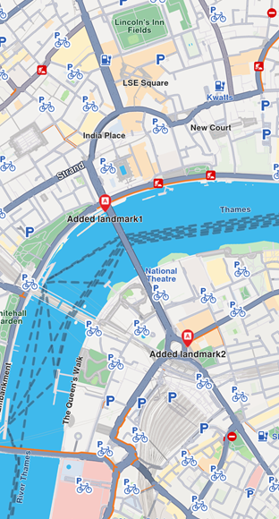

# Display Landmarks
Learn how to filter, add, customize, and highlight landmarks on your map.

## Filter Landmarks by Category
When displaying the map, you can choose what types of landmarks to display. Each landmark can have one or more `LandmarkCategory`. To selectively display specific categories of landmarks, use the `addStoreCategoryId` method:

```
// Clear all the landmark types on the map
mapController.preferences.lmks.clear();

// Display only gas stations
mapController.preferences.lmks.addStoreCategoryId(
GenericCategories.landmarkStoreId, GenericCategoriesId.gasStation.id);
```

This allows filtering the default map data.

## Add Custom Landmarks
Landmarks are added to the map by storing them in a `LandmarkStore`. The `LandmarkStore` is then added to the `LandmarkStoreCollection` within `MapViewPreferences`.

The following code creates custom landmarks, adds them to a store, and adds the store to the collection:

```
final List<Landmark> landmarksToAdd = [];
final Img imageData = await Img.fromAsset('assets/poi83.png');

final landmark1 = Landmark();

landmark1.name = "Added landmark1";
landmark1.coordinates = Coordinates(latitude: 51.509865, longitude: -0.118092);
landmark1.img = imageData;
landmarksToAdd.add(landmark1);

final landmark2 = Landmark();

landmark2.name = "Added landmark2";
landmark2.coordinates = Coordinates(latitude: 51.505165, longitude: -0.112992);
landmark2.img = imageData;
landmarksToAdd.add(landmark2);

final landmarkStore = LandmarkStoreService.createLandmarkStore('landmarks');

for (final lmk in landmarksToAdd) {
  landmarkStore.addLandmark(lmk);
}

mapController.preferences.lmks.add(landmarkStore);
```

Landmarks displayed

### LandmarkStoreCollection methods
The `LandmarkStoreCollection` class provides the following methods:

- `add(LandmarkStore lms)` - Adds a new store to be displayed on the map. All landmarks from the store are displayed, regardless of category.
- `addAllStoreCategories(int storeId)` - Same as `add` but uses the `storeId` instead of the `LandmarkStore` instance.
- `addStoreCategoryId(int storeId, int categoryId)` - Adds landmarks with the specified category from the landmark store.
- `clear()` - Removes all landmark stores from the map.
- `contains(int storeId, int categoryId)` - Checks if the specified category ID from the store ID was already added.
- `containsLandmarkStore(LandmarkStore lms)` - Checks if the specified store has any categories shown on the map.

## Highlight Landmarks
Highlights allow you to customize landmarks, making them more visible and providing render settings options. By default, highlighted landmarks are not selectable but can be made selectable if necessary.

Highlighting a landmark allows you to:

- Customize its appearance
- Temporarily isolate it from standard interactions (default behavior, can be modified)

> 💡 **Tip:** Landmarks retrieved through search can be highlighted to enhance their prominence and customize their appearance. Custom landmarks can also be highlighted, but must be added to a `LandmarkStore` first.

### Activate highlights
Highlights are displayed on the map using `GemMapController.activateHighlight`. Create a Landmark object, add it to a `List<Landmarks>`, and provide `HighlightRenderSettings` for customizations. Then call `activateHighlight` with a unique `highlightId`.

```
final List<Landmark> landmarksToHighlight = [];
final Img imageData = await Img.fromAsset('assets/poi83.png');

final landmark = Landmark();

landmark.name = "New Landmark";
landmark.coordinates = Coordinates(latitude: 52.48209, longitude: -2.48888);
landmark.img = imageData;
landmark.extraImg = imageData;
landmarksToHighlight.add(landmark);

final settings = HighlightRenderSettings(imgSz: 50, textSz: 10, options: {
  HighlightOptions.noFading,
  HighlightOptions.overlap,
});

    
final lmkStore = LandmarkStoreService.createLandmarkStore('landmarks');
lmkStore.addLandmark(landmark);

controller.preferences.lmks.add(lmkStore);

mapController.activateHighlight(
  landmarksToHighlight,
  renderSettings: settings,
  highlightId: 2,
);

mapController.centerOnCoordinates(Coordinates(latitude: 52.48209, longitude: -2.48888), zoomLevel: 40);
```

### Highlight options
The `HighlightOptions` enum provides options to customize highlighted landmark behavior:

| Option | Description |
|-------|-------------|
| `showLandmark` | Shows the landmark icon and text. Enabled by default. |
| `showContour` | Shows the landmark contour area if available. Enabled by default. |
| `group` | Groups landmarks in close proximity. Available only with `showLandmark`. Disabled by default. |
| `overlap` | Overlaps highlight over existing map data. Available only with `showLandmark`. Disabled by default. |
| `noFading` | Disables highlight fading in/out. Available only with `showLandmark`. Disabled by default. |
| `bubble` | Displays highlights in a bubble with custom icon placement. Available only with `showLandmark`. Automatically invalidates `group`. Disabled by default. |
| `selectable` | Makes highlights selectable using `setCursorScreenPosition`. Available only with `showLandmark`. |

>  🚨 **Alert**: When showing bubble highlights, if the whole bubble does not fit on the screen, it will not be displayed at all. Make sure to truncate the text if the text length is very long.

>  🚨 **Alert**: For a landmark contour to be displayed, the landmark must have a valid contour area. Landmarks with a polygon representation on OpenStreetMap will have a contour area. Make sure the contour geographic related fields from the `extraInfo` property of the `Landmark` are not removed or altered.

### Deactivate highlights
To remove a highlighted landmark from the map, use `GemMapController.deactivateHighlight(id`) to remove a specific landmark, or` GemMapController.deactivateAllHighlights()` to clear all highlighted landmarks.

```
mapController.deactivateHighlight(highlightId: 2);
```

### Get highlighted landmarks
To retrieve highlighted landmarks based on a highlight ID:
```
List<Landmark> landmarks = mapController.getHighlight(2);
```
> 💡 **Tip:** Overlay items can also be highlighted using the `activateHighlightOverlayItems` method in a similar way.

## Remove landmarks
To remove all landmarks from the map, call the `removeAllStoreCategories(GenericCategories.landmarkStoreId)` method:
```
mapController.preferences.lmks
    .removeAllStoreCategories(GenericCategories.landmarkStoreId);
```

