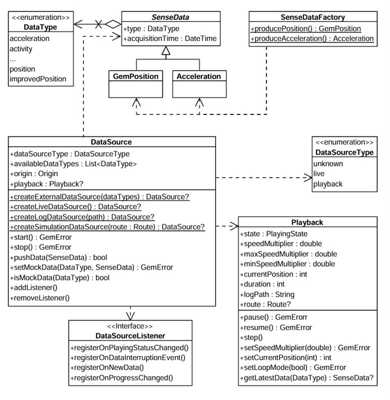

# Sensors and Data Sources
 The Navivation SDK integrates with device sensors and external data sources to enhance map functionality. Use GPS, compass, accelerometer, and custom telemetry to build navigation apps, augmented reality layers, and location-aware services.

 ## Sensor Types
The SDK supports the following sensor data types:

| Type | Description |
|------|-------------|
| `Acceleration` | Measures linear movement of the device in three-dimensional space. Useful for detecting motion, steps, or sudden changes in speed. |
| `Activity` | Represents user activity such as walking, running, or being stationary, typically inferred from motion data. Only available on Android devices. |
| `Attitude` | Describes the orientation of the device in 3D space, often expressed as Euler angles or quaternions. |
| `Battery` | Provides battery status information such as charge level and power state. |
| `Camera` | Indicates data coming from or triggered by the device's camera, such as frames or detection events. |
| `Compass` | Gives directional heading relative to magnetic or true north using magnetometer data. |
| `Magnetic Field` | Reports raw magnetic field strength, useful for environmental sensing or heading correction. |
| `Orientation` | Combines multiple sensors (like accelerometer and magnetometer) to calculate absolute device orientation. |
| `Position` | Basic geographic position data, including latitude, longitude, and optionally altitude. |
| `Improved Position` | Enhanced position data that has been refined using filtering, correction services, or sensor fusion. |
| `Gyroscope` | Measures the rate of rotation around the device’s axes, used to detect turns and angular movement. |
| `Temperature` | Provides temperature readings, either ambient or internal device temperature. |
| `Notification` | Represents external or system-level events that are not tied to physical sensors. |
| `Mount Information` | Describes how the device is physically mounted or oriented within a fixed system, such as in a vehicle. |
| `Heart Rate` | Biometric data representing beats per minute, typically from a fitness or health sensor. |
| `NMEA Chunk` | Raw navigation data in NMEA sentence format, typically from GNSS receivers for high-precision tracking. Only available on Android devices. |
| `Unknown` | A fallback type used when the source of the data cannot be determined. |

More details about the `Position` and `ImprovedPosition` classes are available here.

> ⚠️ **Attention:** Ensure that the specific `DataType` values are supported on the target platform. Attempting to create data sources or recordings with unsupported types may result in failures.

## Working With Data Sources
The main classes for working with data sources:



The `DataType` enum represents multiple data types. Each sensor value is stored in a class derived from `SenseData`, such as `GemPosition` and `Acceleration`.

Use the `SenseDataFactory` helper class to create objects of these types. This class provides static methods like `producePosition` and `produceAcceleration` to create custom sensor data. You'll need this only when creating a custom data source with custom data.

### Create a data source
Create a `DataSource` using one of these static methods:

- `createLiveDataSource` - Collects data from the device's built-in sensors in real time. Most common for applications relying on actual sensor input
- `createExternalDataSource` - Accepts user-supplied data. Feed data into this source via the `pushData` method. Note that `pushData` returns `false` if used with a non-external source
- `createLogDataSource` - Replays data from a previously recorded session (log file: gpx, nmea). Useful for debugging, training, or offline data processing. See the [Recorder docs](06-Recorder.md) for recording data
- `createSimulationDataSource` - Simulates movement along a specified route. Use for UI prototyping, testing, or feature validation without real-world movement

The first two types (live and external) are categorized under `DataSourceType.live`. The latter two (log and simulation) fall under `DataSourceType.playback`.

> 📝 **Note:** By default, a data source starts automatically upon creation. However, it may not be fully initialized when you obtain the data source object.

If you add a `DataSourceListener` immediately after acquiring the data source, you may miss the initial "playing status changed" notification—the data source may already be in the started state when the listener is attached.

### Configure and control a data source
Stop or start a data source using the control methods:
```
dataSource.stop();
// ...
dataSource.start();
```
Configure a data source's behavior using these methods:

- `setConfiguration` - Set the sampling rate or data filtering behavior
- `setMockPosition` - Simulate location updates

> ⚠️ **Attention:** The `setMockPosition` method is only available for live data sources and supports only the `DataType.position` type. To mock other data types, use an external `DataSource`.

### Use DataSourceListener
Register a `DataSourceListener` to receive updates from a data source. React to various events:

- Changes in the playing status
- Interruptions in data flow (e.g., sensor stopped, app went to background)
- New sensor data becoming available
- Progress updates during playback

Create a listener using the factory constructor and pass the appropriate callbacks:

```
final listener = DataSourceListener(
  onPlayingStatusChanged: (dataType, status) {
    print('Status for $dataType changed to $status');
  },
  onDataInterruptionEvent: (dataType, reason, ended) {
    print('Data interruption on $dataType: $reason. Ended: $ended');
  },
  onNewData: (data) {
    print('New data received: $data');
  },
  onProgressChanged: (progress) {
    print('Playback progress: $progress%');
  },
);
```
Register this listener with a DataSource for a specific DataType (in this case the position):

```
myDataSource.addListener(DataType.position, listener);
```
Remove the listener when no longer needed:

```
myDataSource.removeListener(DataType.position, listener);
```

## Use the Playback Interface
The `Playback` interface controls data sources that support playback functionality—specifically those of type `DataSourceType.playback`, such as log files or simulated route replays. **It is not compatible with live or custom data sources.**

Access a `Playback` instance by checking the data source type:
```
if(myDataSource.dataSourceType == DataSourceType.playback) {
  final playback = myDataSource.playback!;

  playback.pause();
  // ...
  playback.resume();
}
```

Playback-enabled data sources can be paused and resumed. Adjust the playback speed by setting a `speedMultiplier`, which must fall within the range defined by Playback.`minSpeedMultiplier` and Playback.`maxSpeedMultiplier`.

Control playback position using Playback.`currentPosition`, which represents the elapsed time in milliseconds from the beginning of the log or simulation. This allows you to skip to any point in the playback.

Access supplementary metadata:

- `Playback.logPath` - Path to the log file being executed
- `Playback.route` - Route being simulated (if applicable)

## Track positions
Track positions from a `DataSource` on a map by rendering a marker polyline between relevant map link points. Use the `MapViewExtensions` class member of `GemMapController`.


Tracked path

```
final mapViewExtensions = controller.extensions;

final err = mapViewExtensions.startTrackPositions(
    updatePositionMs: 500,
    settings: MarkerCollectionRenderSettings(
    polylineInnerColor: Colors.red,
    polylineOuterColor: Colors.yellow,
    polylineInnerSize: 3.0,
    polylineOuterSize: 2.0),
dataSource: dataSource);

// other code ...

mapViewExtensions.stopTrackPositions();
```

| Method | Parameters | Return type |
|--------|------------|-------------|
| `startTrackPositions` | - updatePositionMs - Tracked position collection update frequency. High frequency may decrease rendering performance on low-end devices<br>- MarkerCollectionRenderSettings - Markers collection rendering settings in the map view<br>- DataSource? - DataSource object which positions are tracked | `GemError` |
| `stopTrackPositions` |  | - `GemError.success` on success<br>- `GemError.notFound` if tracking is not started |
| `isTrackedPositions` |  | `bool` |
| `trackedPositions` |  | `List<Coordinates>` |

> 📝 **Note:** f the `dataSource` parameter is left null, tracking uses the current `DataSource` set in `PositionService`. If no `DataSource` is set in `PositionService`, `GemError.notFound` is returned.

### Get tracked positions
Retrieve tracked positions using the `trackedPositions` getter after calling `MapViewExtensions.startTrackPositions`. This returns a list of `Coordinates` used to render the path polyline on `GemMap`.
```
final mapViewExtensions = controller.extensions;

mapViewExtensions.trackedPositions;

// other code ...

mapViewExtensions.stopTrackPositions();
```
> ⚠️ **Attention:** Calling the `trackedPositions` getter after `stopTrackPositions` returns an empty list.


