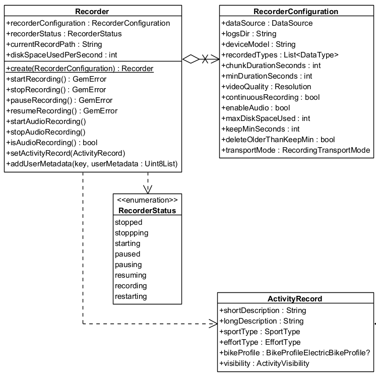
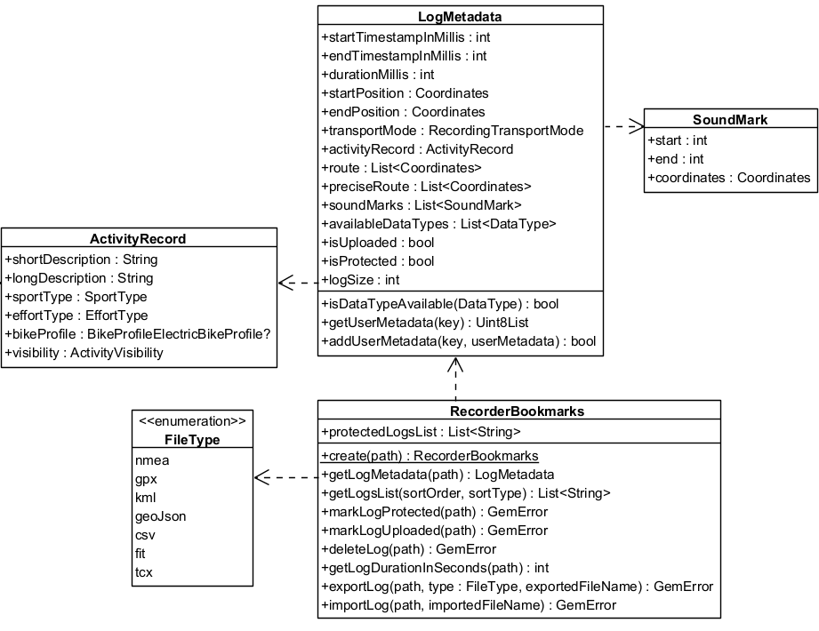

# Recorder
The Recorder module manages sensor data recording with configurable parameters through `RecorderConfiguration`:

- **Customizable storage options** - Define log directories, manage disk space, and specify recording duration
- **Data type selection** - Specify which data types (video, audio, or sensor data) to record
- **Video and audio options** - Set video resolution, enable/disable audio recording, and manage chunk durations. Record sensor data only, sensor data + video, sensor data + audio, or all three

Control the recording lifecycle:

- Start, stop, pause, and resume recordings
- Automatic restarts for continuous recording with chunked durations

The Recorder supports various transportation modes (car, pedestrian, bike), enabling detailed analysis and classification based on context. Set disk space limits to prevent overwhelming device storage—logs are automatically managed based on retention thresholds.

The main classes used by the Recorder:


## Initialize the Recorder
Use the `create` method to obtain a configured Recorder instance:

```
RecorderConfiguration recorderConfiguration = RecorderConfiguration(
   dataSource: dataSource,
   logsDir: tracksPath,
   recordedTypes: [DataType.position],
);

Recorder recorder = Recorder.create(recorderConfiguration);
```
> 📝 **Note:** If the `dataSource`, `logsDir`, and `recordedTypes` parameters are not populated with valid data, the `startRecording` method returns `GemError.invalidInput` and no data is recorded.

### Configure the RecorderConfiguration

| Recorder configuration attribute | Description |
|----------------------------------|-------------|
| dataSource | The source providing the data to be recorded. |
| logsDir | The directory used to keep the logs |
| deviceModel | The device model. Deprecated, use hardwareSpecifications instead. |
| hardwareSpecifications | Extensive details about the device as a hashmap. |
| recordedTypes | The data types that are recorded |
| minDurationSeconds | The minimum duration for the recording to be saved |
| videoQuality | The video quality |
| chunkDurationSeconds | The chunk duration time in seconds |
| continuousRecording | Whether the recording should continue automatically when chunk time achieved |
| enableAudio | This flag will be used to determine if audio is needed to be recorded or not |
| maxDiskSpaceUsed | When reached, it will stop the recording |
| keepMinSeconds | Will not delete any record if this threshold is not reached |
| deleteOlderThanKeepMin | Older logs that exceeds minimum kept seconds threshold should be deleted |
| transportMode | The transport mode |


> ⚠️ **Attention:** If the log duration is shorter than `minDurationSeconds`, the `stopRecording` method does not save the recording and returns `GemError.recordedLogTooShort`.
>
> The `GemError.recordedLogTooShort` error may also occur if an insufficient number of positions were emitted, even when the duration between `startRecording` and `stopRecording` exceeds `minDurationSeconds`. To test recording functionality, create a custom external `DataSource` and push custom positions. Refer to the [custom positioning guide](05-Custom%20Positioning.md) for details. The external `DataSource` must be provided to the `RecorderConfiguration` object.
>
> The `GemError.general` result might be returned if the application has been sent to background without the required configuration. See the [record while app is in background](#record-while-app-is-in-background) section below.
> 
> If `minChunkDuration` is set too high, it may cause G`emError.noDiskSpace` since the SDK determines how much space is required for the entire chunk.
>
>Ensure that the `DataType` values passed to the `recordedTypes` parameter are supported by the target platform. For example, specifying `DataType.nmeaChunk` on iOS causes the startRecording method to return `GemError.invalidInput`. See more details about sensor types [here](02-Sensors%20and%20Data%20Sources.md).

> 💡 **Tip:** Use the [path_provider](/link:https://pub.dev/packages/path_provider) package to obtain a valid path to save recordings. The following snippet shows how to obtain a valid folder path in a platform-independent way:
> ```
> Future<String> getTracksPath() async {
>   // Requires the path_provider package
>   final rootDir = await path_provider.getApplicationDocumentsDirectory();
>   final tracksPath = path.joinAll([rootDir.path, "Data", "Tracks"]);
>   return tracksPath;
>}
>```

The `videoQuality` parameter is based on the `Resolution` enum. Each value represents a standard video resolution that affects recording quality and storage requirements.

### Camera Resolutions

| Resolution Enum Value | Description | Dimensions (pixels) |
|----------------------|-------------|---------------------|
| `Resolution.unknown` | No resolution set. | — |
| `Resolution.sd480p` | Standard Definition | 640 × 480 |
| `Resolution.hd720p` | High Definition | 1280 × 720 |
| `Resolution.fullHD1080p` | Full HD | 1920 × 1080 |
| `Resolution.wqhd1440p` | Wide Quad HD | 2560 × 1440 |
| `Resolution.uhd4K2160p` | Ultra HD (4K) | 3840 × 2160 |
| `Resolution.uhd8K4320p` | Ultra HD (8K) | 7680 × 4320 |


> 💡 **Tip:** The actual disk usage depends on platform and encoding settings. Here are rough size estimates used internally by the SDK for calculating space requirements:
> 
> | Resolution | Approx. Bytes/sec | Approx. MB/min |
>|-----------|-------------------|----------------|
>| sd480p | 210,000 | ~12 MB/min |
>| hd720p (iOS) | 1,048,576 | ~60 MB/min |
>| hd720p (Android) | 629,760 | ~37 MB/min |
>| fullHD1080p | 3,774,874 | ~130 MB/min |
>
>> Note: 1 MB = 1,048,576 bytes (binary MB). These are estimates and may vary slightly by platform and encoding settings.
>
>> Note: These values are used to pre-check disk availability when `chunkDurationSeconds` is set.
>

### Recording lifecycle
1. **Start the Recorder** - Call the `startRecording` method to initiate recording. The recorder transitions to the recording state
   
2. **Pause and resume** - Use `pauseRecording` and `resumeRecording` to manage interruptions

3. **Chunked recordings** - If a chunk duration is set in the configuration, the recording automatically stops when the duration is reached. A new recording begins seamlessly if continuous recording is enabled, ensuring uninterrupted data capture

4. **Stop the Recorder** - The `stopRecording` method halts recording, and the system ensures logs meet the configured minimum duration before saving them as `.gm` files inside `logsDir`

## Use the Recorder
The following sections present use cases for the recorder:
```
String tracksPath = await _getTracksPath();
DataSource? dataSource = DataSource.createLiveDataSource();

if (dataSource == null){
   showSnackbar("The datasource could not be created");
   return;
}

RecorderConfiguration recorderConfiguration = RecorderConfiguration(
   dataSource: dataSource,
   logsDir: tracksPath,
   recordedTypes: [DataType.position],
);

// Create recorder based on configuration
final recorder = Recorder.create(recorderConfiguration);

GemError errorStart = await recorder.startRecording();
if (errorStart != GemError.success) {
   showSnackbar("Error starting recording: $errorStart");
}
 
// Other code

GemError errorStop = await recorder.stopRecording();
if (errorStop != GemError.success) {
   showSnackbar("Error stopping recording: $errorStop");
}
```
> ⚠️ **Attention:** The `Recorder` only saves data explicitly defined in the `recordedTypes` list. Any other data is ignored.

> ⚠️ **Attention:** The `startRecording` and `stopRecording` methods must be awaited to ensure proper execution. Otherwise, unexpected behavior may occur.

> 💡 **Tip:** Request permission for location usage before starting a recorder.

## Recorder Permissions

**Android**

To use the recorder with **camera**, **microphone**, and optionally **location or external media access**, you need to declare the appropriate permissions in your `AndroidManifest.xml`.

By default, recordings can be saved in your app's internal storage. This requires only camera, audio, and location permissions.

However, if you want to save recordings to the **device's gallery**, **Downloads folder**, or any **public/external storage**, you’ll also need additional media permissions.

```
<!-- Required for camera recording -->
<uses-permission android:name="android.permission.CAMERA" />

<!-- Required for audio recording -->
<uses-permission android:name="android.permission.RECORD_AUDIO" />

<!-- Required if your recording setup uses location data -->
<uses-permission android:name="android.permission.ACCESS_FINE_LOCATION" />
<uses-permission android:name="android.permission.ACCESS_COARSE_LOCATION" />

<!-- Required if saving to public folders or accessing gallery content -->
<uses-permission android:name="android.permission.READ_MEDIA_IMAGES" /> <!-- Android 13+ -->
<uses-permission android:name="android.permission.READ_EXTERNAL_STORAGE" />
```
    These permissions should be placed inside the `<manifest>` block of your `android/app/src/main/AndroidManifest.xml`.

    Runtime permission requests are also required on Android 6.0+ (API 23+). Use a library like `permission_handler` to manage them.

More info: [Android Manifest permissions](/link:https://developer.android.com/reference/android/Manifest.permission)


**iOS**

On iOS, you need to declare your app’s intent to use the camera, microphone, and optionally, the user’s location, in the `ios/Runner/Info.plist` file.

Add the following entries inside the `<dict>` block:
```
<!-- Required for camera recording -->
<key>NSCameraUsageDescription</key>
<string>This app requires camera access to record video.</string>

<!-- Required for audio recording -->
<key>NSMicrophoneUsageDescription</key>
<string>This app requires microphone access to record audio.</string>

<!-- Required if using location data during recording -->
<key>NSLocationWhenInUseUsageDescription</key>
<string>Location is needed for recording location-tagged videos.</string>
```
    iOS will automatically prompt the user for these permissions the first time they are accessed. Be sure your app handles denial gracefully.

More info: [Apple App Privacy & Permissions](/link:https://developer.apple.com/documentation/bundleresources/information-property-list)

## Record Metrics
The `RecordMetrics` object provides performance metrics for a recorded activity.

Available only when the recorder is in `RecorderStatus.recording` status.

Access these metrics:

- `distanceMeters` - Total distance traveled in meters
- `elevationGainMeters` - Total elevation gain in meters
- `avgSpeedMps` - Average speed in meters per second

Use these values to analyze ride or workout performance, monitor progress, and build custom dashboards or statistics.

```
GemError errorStart = await recorder.startRecording();
if (errorStart != GemError.success) {
   showSnackbar("Error starting recording: $errorStart");
}

// Get the recorder metrics at any time while recording
final metrics = recorder.metrics;

print("Average speed: ${metrics.avgSpeedMps}");
print("Distance in meters: ${metrics.distanceMeters}");
print("Elevation gain: ${metrics.elevationGainMeters}");
```
> 💡 **Tip:** The metrics reset at the start of each recording. Once the recording stops, the collected data is available in LogMetadata

## Record audio
Enable audio recording by setting the `enableAudio` parameter in the `RecorderConfiguration` to true. Call the `startAudioRecording` method from the `Recorder` class to start, and use `stopAudioRecording` to stop:
```
RecorderConfiguration recorderConfiguration = RecorderConfiguration(
   dataSource: dataSource,
   logsDir: tracksPath,
   recordedTypes: [DataType.position],
   enableAudio: true
);

// Create recorder based on configuration
Recorder recorder = Recorder.create(recorderConfiguration);

GemError errorStart = await recorder.startRecording();
if (errorStart != GemError.success) {
   showSnackbar("Error starting recording: $errorStart");
}

// At any moment enable audio recording
recorder.startAudioRecording();

// Other code

// At any moment stop audio recording
recorder.stopAudioRecording();

GemError errorStop = await recorder.stopRecording();
if (errorStop != GemError.success) {
   showSnackbar("Error stopping recording: $errorStop");
}
```
> 💡 **Tip:** Audio recording results in a log file of type `.mp4`. This file also contains the binary data of a `.gm` file and is accessible by system players.

> ⚠️ **Attention:** Request permission for microphone usage when setting the `enableAudio` parameter to `true`.

## Record video
Enable video recording by adding `DataType.camera` to the `recordedTypes` and setting the `videoQuality` parameter in the `RecorderConfiguration` to your desired resolution (we recommend `Resolution.hd720p`). Video recording starts when calling `startRecording` and stops at `stopRecording`:

```
RecorderConfiguration recorderConfiguration = RecorderConfiguration(
   dataSource: dataSource,
   logsDir: tracksPath,
   videoQuality: Resolution.hd720p,
   recordedTypes: [DataType.position, DataType.camera],
);

// Create recorder based on configuration
Recorder recorder = Recorder.create(recorderConfiguration);

GemError errorStart = await recorder.startRecording();
if (errorStart != GemError.success) {
   showSnackbar("Error starting recording: $errorStart");
}

// Other code

GemError errorStop = await recorder.stopRecording();
if (errorStop != GemError.success) {
   showSnackbar("Error stopping recording: $errorStop");
}
```
> 💡 **Tip:** Camera recording results in a log file of type `.mp4`. This file also contains the binary data of a `.gm` file and is accessible by system players.

> ⚠️ **Attention:** Request permission for camera usage when adding the `DataType.camera` parameter to `recordedTypes`.


> ⚠️ **Attention:** When `chunkDuration` is set, the SDK checks available disk space before starting the recording.
>
> If there isn't enough space to store an entire chunk (based on the selected resolution), the recorder does not start and returns `GemError.noDiskSpace`.
>
> Estimate required storage ahead of time. See [Camera Resolutions](#camera-resolutions) for expected sizes.


## Record Multimedia
Record a combination of audio, video, and sensors by setting up the `RecorderConfiguration` with all desired functionalities:
```
RecorderConfiguration recorderConfiguration = RecorderConfiguration(
   dataSource: dataSource,
   logsDir: tracksPath,
   videoQuality: Resolution.hd720p,
   recordedTypes: [DataType.position, DataType.camera],
   enableAudio: true
);

// Create recorder based on configuration
Recorder recorder = Recorder.create(recorderConfiguration);

GemError errorStart = await recorder.startRecording();
if (errorStart != GemError.success) {
   showSnackbar("Error starting recording: $errorStart");
}

// At any moment enable audio recording
recorder.startAudioRecording();

// Other code

// At any moment stop audio recording
recorder.stopAudioRecording();

GemError errorStop = await recorder.stopRecording();
if (errorStop != GemError.success) {
   showSnackbar("Error stopping recording: $errorStop");
}
```

> 💡 **Tip:** Audio recording results in a log file of type `.mp4`. This file also contains the binary data of a `.gm` file and is accessible by system players.

> ⚠️ **Attention:** Request permission for camera and microphone usage when setting the `enableAudio` parameter to `true` and adding the `DataType.camera` parameter to `recordedTypes`.

## Background Location Recording
Enable location recording while the app is in background by enabling the `allowsBackgroundLocationUpdates` flag on the `PositionSensorConfiguration` of the data source. Update the Android and iOS platform-specific configuration files.

### Dart Example
```
final logsDir = await _getLogsDir();

// Create the live data source
final dataSource = DataSource.createLiveDataSource()!;

// Enable background location updates
final config = dataSource.getConfiguration(DataType.position);
config.allowsBackgroundLocationUpdates = true;
dataSource.setConfiguration(type: DataType.position, config: config);

// Create the recorder with config
final recorder = Recorder.create(
  RecorderConfiguration(
    dataSource: dataSource,
    logsDir: logsDir,
    recordedTypes: [DataType.position],
  ),
);

// Start recording
final errorStart = await recorder.startRecording();
if (errorStart != GemError.success) {
  showSnackbar("Error starting recording: $errorStart");
}
```

**Android**

### Android manifest
Add the following permissions to `android/app/src/main/AndroidManifest.xml`:

```
<!-- Foreground location -->
<uses-permission android:name="android.permission.ACCESS_FINE_LOCATION" />
<uses-permission android:name="android.permission.ACCESS_COARSE_LOCATION" />

<!-- Background location (required for Android 10+) -->
<uses-permission android:name="android.permission.ACCESS_BACKGROUND_LOCATION" />
```
> 💡 **Tip:** To record while the app is in background, ensure the device/battery settings allow background activity.

### Runtime permission
On Android 6.0+ (API 23+), background location requires runtime permissions. Use `permission_handler`:

```
await Permission.locationAlways.request();
```
**iOS**

### Info.plist
Add the following entries to your `ios/Runner/Info.plist` inside the `<dict>` block:
```
<key>NSLocationWhenInUseUsageDescription</key>
<string>Location is needed for map localization and navigation.</string>

<key>NSLocationAlwaysAndWhenInUseUsageDescription</key>
<string>Location access is required in background to continue recording.</string>

<key>UIBackgroundModes</key>
<array>
  <string>location</string>
</array>
```


> ⚠️ **Attention:** If the `allowsBackgroundLocationUpdates` flag is not enabled and the app is backgrounded during recording, calling `stopRecording` may result in Gem`Error.general`.

## Recorder bookmarks and metadata
The SDK uses the proprietary `.gm` file format for recordings, offering advantages over standard file types:

- Supports multiple data types, including acceleration, rotation, and more
- Allows embedding custom user data in binary format
- Enables automatic storage management by the SDK to optimize space usage

Recordings are saved as `.gm` or `.mp4` files by the Recorder. The `RecorderBookmarks` class manages recordings, including exporting `.gm` or `.mp4` files to other formats such as `.gpx`, importing external formats, and converting them to `.gm` for seamless SDK integration.

The `LogMetadata` class provides an object-oriented representation of a `.gm` or `.mp4` file, offering features such as retrieving start and end timestamps, coordinates, and path details at varying levels of precision.

Use the `RecorderBookmarks` class for enhanced log management:

- **Export and import logs** - Convert logs to/from different formats such as GPX, NMEA, and KML
- **Log metadata** - Retrieve details like start and end timestamps, transport mode, and size

The main classes used by the RecorderBookmarks:




### Export logs
```
// Create recorderBookmarks
// It loads all .gm and .mp4 files at logsDir
RecorderBookmarks? bookmarks = RecorderBookmarks.create(tracksPath);

if(bookmarks == null) return;

// Get list of logs
List<String> logList = bookmarks.getLogsList();

// Export last recording as a GPX file with a given name
// Assumes the logList is not empty
GemError exportLogError = bookmarks.exportLog(
   logList.last,
   FileType.gpx,
   exportedFileName: "My_File_Name",
);
if (exportLogError != GemError.success) {
   showSnackbar("Error exporting log: $exportLogError");
}
```
The resulting file is `My_File_Name.gpx`. If the name of the exported file is not specified, the log name is used.

> ⚠️ **Attention:** Exporting a `.gm` file to other formats may result in data loss, depending on the data types supported by each format.

> 💡 **Tip:** The exported file is saved in the same directory as the original log file.

### Import logs
Import logs by loading a standard file format (such as `gpx`, `nmea`, or `kml`) into a `.gm` file for further processing:

```
GemError importError = bookmarks.importLog("path/to/file", importedFileName: "My_File_Name");
if (importError != GemError.success) {
   showSnackbar("Error importing log: $importError");
}
```
### Access metadata
Access metadata for each log through the `LogMetadata` class:
```
RecorderBookmarks? bookmarks = RecorderBookmarks.create(logsDir);
if(bookmarks != null) {
   LogMetadata? logMetadata = bookmarks.getLogMetadata(logList.last);
}
```
> ⚠️ **Attention:** The `getLogMetadata` method returns `null` if the log file does not exist inside the `logsDir` directory or if the log file is not a valid `.gm `file.

The metadata within a `LogMetadata` object contains:

- **startPosition / endPosition** - Geographic coordinates for the log's beginning and end
- **getUserMetadata / addUserMetadata** - Store and retrieve additional data using a key-value approach
- **preciseRoute** - Comprehensive list of all recorded coordinates, capturing the highest level of detail possible
- **route** - List of route coordinates spaced at least 20 meters apart, with a three-second recording delay between each coordinate
- **transportMode** - `RecordingTransportMode` of recording
- **startTimestampInMillis / endTimestampInMillis** - Timestamp of the first/last sensor data
- **durationMillis** - Log duration
- **isProtected** - Check if a log file is protected. Protected logs are not automatically deleted after `keepMinSeconds` specified in `RecorderConfiguration`
- **logSize** - Log size in bytes
- **isDataTypeAvailable** - Verify if a data type is produced by the log file
- **soundMarks** - List of recorded soundmarks
- **activityRecord** - Recorded activity details
- **logMetrics** - Basic metrics about the recorded log

To visualize the recorded route, construct a `Path` object using the route coordinates from the `LogMetadata`. Display this path on a map. For more details, refer to the documentation on the [path entity](../03-Core/02-Base%20Entities.md#path) and [display paths](../04-Maps/05-Display%20Map/06-Display%20Paths.md#display-paths).

### Custom user metadata
Add custom metadata to a log during recording or after completion using the `addUserMetadata` method, available in both the `Recorder` and `LogMetadata` classes. The method requires a `String` key and the associated data as a `Uint8List`.

Retrieve previously added metadata using the `getUserMetadata` method of the `LogMetadata` class:

```
LogMetadata? logMetadata = recorderBookmarks!.getLogMetadata(logPath);

// Save image encoded in Uint8List
Uint8List imageSample = ...;
logMetadata?.addUserMetadata("ImgData", imageSample);

// Save text by encoding to Uint8List
String text = 'Hello world!';
final encodedText = utf8.encode(text);

// Get image
Uint8List? imageData = logMetadata?.getUserMetadata("ImgData");

// Get text
Uint8List? encodedTextGot = logMetadata?.getUserMetadata("textData");
String? textData = encodedTextGot != null ? utf8.decode(encodedTextGot) : null;
```

## Record While App Is in Background
Recording might fail with error code `GemError.general` when calling `stopRecording` if the app is sent to background during recording. Set `positionActivity` to true on the `PositionActivity` associated with the data source before instantiating the `Recorder`:

```
DataSource dataSource = DataSource.createLiveDataSource()!;

PositionSensorConfiguration sensorConfiguration = dataSource.getConfiguration(DataType.position);
sensorConfiguration.allowsBackgroundLocationUpdates = true;
dataSource.setConfiguration(type: DataType.position, config: sensorConfiguration);

RecorderConfiguration recorderConfiguration = RecorderConfiguration(
   recordedTypes: [DataType.position],
   logsDir: logsDir,
   hardwareSpecifications: {},
   minDurationSeconds: 5,
   dataSource: dataSource,
);

Recorder _recorder = Recorder.create(
   recorderConfiguration
);
```

### iOS configuration
Add the `NSLocationAlwaysUsageDescription` and `UIBackgroundModes` keys to the `Info.plist` file, within the `<dict>` block:

```
<key>NSLocationAlwaysAndWhenInUseUsageDescription</key>
<string>Location is needed for map localization and navigation.</string>
```
and
```
<key>UIBackgroundModes</key>
<array>
<string>fetch</string>
<string>location</string>
</array>
```
### Android configuration
Add the `ACCESS_BACKGROUND_LOCATION` permission to the app's manifest file.


## ActivityRecord
The `ActivityRecord` class captures details about a recorded activity, including descriptions, sport type, effort level, and visibility settings.

### Attributes

| Attribute | Description |
|-----------|-------------|
| shortDescription | A brief summary of the activity. |
| longDescription | A detailed explanation of the activity. |
| sportType | The type of sport involved in the activity. |
| effortType | The intensity of effort (e.g., easy, moderate, hard). |
| bikeProfile | Bike profile details (if applicable). |
| visibility | Defines who can view the activity. |

## LogMetrics
The `LogMetrics` object provides essential statistics about a recorded log. These metrics are useful for analyzing movement, elevation, and speed data.

| Attribute | Description |
|-----------|-------------|
| distanceMeters | Total distance covered during the log, measured in meters. |
| elevationGainMeters | Total elevation gained over the course of the log, measured in meters. |
| avgSpeedMps | Average speed throughout the log, measured in meters per second. |


### Setting the activity record
```
GemError errorStart = await recorder.startRecording();
if (errorStart != GemError.success) {
   showSnackbar("Error starting recording: $errorStart");
}

// Other code
recorder.activityRecord = ActivityRecord(
  shortDescription: "Morning Run",
  longDescription: "A 5km run through the park.",
  sportType: SportType.run,
  effortType: EffortType.moderate,
  visibility: ActivityVisibility.everyone,
);

// Other code

GemError errorStop = await recorder.stopRecording();
if (errorStop != GemError.success) {
   showSnackbar("Error stopping recording: $errorStop");
}
```
> ⚠️ **Attention:** Call this method while recording. Calling it after stopping does not affect existing recordings.

### Get the activity record
```
final bookmarks = RecorderBookmarks.create(tracksPath);
if (bookmarks == null){
   showSnackbar("Bookmarks could not be created");
   return;
}

final logList = bookmarks.getLogsList();

LogMetadata? metadata = bookmarks.getLogMetadata(logList.last);

if (metadata == null) {
   showSnackbar("Log metadata could not be retrieved");
   return;
}

ActivityRecord activityRecord = metadata.activityRecord;
```


